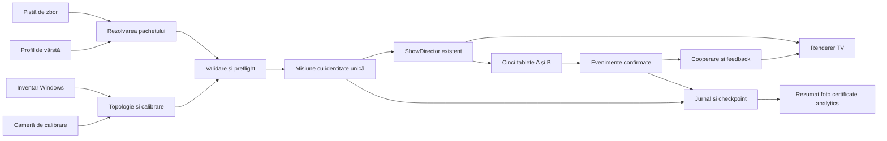

# Plan tehnic pentru automatizarea NavaPlayer și scenariile pe vârste

> Actualizare ulterioară: implementarea autorizată după acest plan este descrisă în [IMPLEMENTARE-SCENARII-DISPLAY.md](IMPLEMENTARE-SCENARII-DISPLAY.md). Formulările de mai jos păstrează starea istorică a livrării de planificare.

Data: 5 septembrie 2026. Bază inspectată: branch `board/nava-player`, HEAD `e20c506`, cu implementările Nava Glass și video wall existente în worktree, încă necomise.

**Stare: plan de implementare.** Acest document definește arhitectura, contractele, pașii și verificările pentru cererea curentă. Funcțiile descrise ca propuneri nu sunt implementate prin această livrare. Scenariile celor patru categorii primesc întâi structură tehnică; redactarea replicilor, scenografia și producția vocilor rămân o etapă distinctă.

Rezultatul urmărit este un player care își configurează automat ieșirile disponibile, încarcă un pachet de scenariu verificat înainte de fiecare grup, păstrează identitatea misiunii pe toate dispozitivele și poate recupera controlat o sesiune întreruptă. Motorul existent, filmul și show-ul V3.3 rămân baza de compatibilitate.

## 1 Domeniul cerut

Numerele 3, 4, 6, 7, 8, 9 și 10 sunt interpretate ca upgrade-urile din lista precedentă, nu ca o limitare a numărului de display-uri.

| Cerere | Livrabil tehnic planificat |
|---|---|
| Detecție și împărțire automată | Inventar nativ de display-uri, identificare persistentă, selecția ieșirilor de public, generare automată de viewport-uri și geometrie |
| Calibrare automată | Calibrare logică din Windows; calibrare optică prin cameră pentru ordinea fizică, margini și unghiuri; profil persistent reutilizat la pornire |
| 3 Identitatea misiunii | `runId` autoritar și eliminarea evenimentelor întârziate din alte rulări |
| 4 Repetiție tehnică automată | Runner separat pentru video, GLB, voci, tablete, sincronizare, performanță și raport |
| 6 Cooperarea celor cinci posturi | Model comun derivat din alegerile confirmate, cu reguli deterministe și rezultat colectiv |
| 7 Legătura tabletă și TV | Evenimente vizuale identificabile, sincronizate și deduplicate între post și renderer |
| 8 Accesibilitate | Setări independente pe post, aplicate fără schimbarea profilului narativ sau a timingului |
| 9 Recuperare controlată | Jurnal durabil, checkpoint, reluare în pauză și reconcilierea dispozitivelor |
| 10 Final personalizat | Rezumat de misiune autoritar, hartă a alegerilor, fotografie opțională și certificate legate de aceeași rulare |
| Patru categorii de vârstă | Catalog, manifest, încărcare, validare, editor și preflight pentru 5–10, 10–15, 15–18 și adulți |

Un film panoramic nou și un tutorial suplimentar pentru copii, punctele 1 și 5 din lista precedentă, nu sunt incluse în această implementare planificată. Nu sunt incluse controlul Unitree H2, capsula VR, generarea de replici în timpul show-ului sau producția de conținut nou. Funcțiile live deja existente își păstrează traseele de operare.

Configurația confirmată a sălii rămâne 98″ – 98″ – 115″ – 98″ – 98″, toate TV-urile Samsung QN90F pe același PC. Căpitanul este GLB numai pe ecranul central de 115″. Sunt cinci tablete de post și o tabletă separată de operator, toate 1920×1080 landscape; A în stânga, B în dreapta, text orientat normal. Numărul de TV-uri poate varia; cele cinci posturi nu se multiplică odată cu TV-urile.

## 2 Sursele și limitele lor

Cererea curentă și configurația fizică confirmată au prioritate. Atașamentele sunt referințe de conținut și traiectorie. Comenzile SpaceEngine și indicațiile de regie din ele nu reprezintă instrucțiuni de executat în repository sau de conectat hardware.

| Sursă inspectată | Ce extragem | Ce nu transferăm automat |
|---|---|---|
| `A Patra Lume Scenariu (1).docx` | Structura inițială pe lumi, separarea personajelor, ideea adaptării pentru grupuri diferite | Căpitan fizic Unitree, doi roboți mici, Avatar AI umanoid pe TV, capsulă VR, regie AI care schimbă liber timpul |
| `A_PATRA_LUME_SMOOTH_APPROACH_MANN_NO_TEXT.txt` | Ruta Earth → Siwarha → Kepler-186 d → Mann → Gargantua → Gargantua Wormhole → Saturn → Earth; etape de apropiere, orbită și plecare | Executarea scriptului, înlocuirea filmului, suprascrierea timpilor V3.3 sau presupunerea unei proiecții panoramice reale |
| `assets/show/show.json` | Show executabil `0.5.0-ro-stage`, 87 cue-uri, `timingStatus: aligned`, intervalele actuale | Redactarea celor patru scenarii prin copierea și redenumirea show-ului |
| Codul și testele actuale | Contractele reale, autentificare, efecte, readiness, renderer și limite | Afirmații istorice că anumite componente sunt încă doar schelete |

Word-ul a fost citit integral, inclusiv paragrafele din tabele, antetul și subsolul. El descrie o împărțire istorică de aproximativ opt minute în sală și două în VR; aceasta nu înlocuiește epilogul continuu deja implementat. Nu se livrează o revizie grafică a documentului Word.

Fișierul TXT are un antet mai vechi care omite Mann, dar ruta finală și comenzile efective îl includ. Metadatele importului vor păstra această diferență. `FOV 50` și regula de mișcare continuă sunt metadate despre camera sursă, nu o promisiune că filmul conține un câmp vizual suficient pentru întregul perete.

### Diferența de timp care trebuie rezolvată prin aliniere

Show-ul curent folosește 50 s preshow + 10 s lead-in + 465 s film + 75 s epilog = **600 s**. Cele **61 de instrucțiuni explicite `Wait`** din TXT însumează **625,5 s**. Suma nu certifică durata unui export SpaceEngine: trebuie verificată semantica comenzilor și apoi filmul efectiv. Nu se adună mecanic și valorile `Time` ale mișcărilor, deoarece acestea pot suprapune așteptările.

| Reper din TXT | Linie | Suma `Wait` înaintea comenzii |
|---|---:|---:|
| Select Siwarha | 147 | 40,5 s |
| Select Kepler-186 d | 204 | 160,5 s |
| Select Mann | 260 | 279,5 s |
| Select Gargantua | 314 | 372,5 s |
| Select Gargantua Wormhole | 330 | 426,5 s |
| Select Saturn | 381 | 474,5 s |
| Select Earth pentru întoarcere | 426 | 511,5 s |
| Sfârșitul așteptărilor | — | 625,5 s |

Aceste valori sunt repere pentru import, nu timecode-uri ale filmului actual și nici momente de sosire. Catalogul va păstra separat pista actuală aliniată și pista importată provizorie. Saturn nu are o scenă separată în show-ul executabil actual; nu îi inventăm o fereastră de redare.

Amprentele SHA-256 ale surselor citite:

```text
DOCX       2839cdb324142662dc72c6f1b9d217fb29adf27ed14be8f2539caa12c98aa4b8
TXT        e494e01acc8eec100eebefd384733ab0c3d5379745c45a261dcf9bcbec60f954
show.json  0d22c706c5346396c9a62f848cec3d4f8c2e0adbf83bfac8c7ebb3093b2b0c03
```

Atașamentele rămân la căile furnizate în `C:/Users/Chris/Downloads/`. În implementare, un import explicit va crea referințe de proiect și metadate de proveniență; playerul distribuit nu va depinde de folderul Downloads.

## 3 Punctele reale de plecare din cod

| Domeniu | Există acum | Extensia necesară |
|---|---|---|
| TV | `src/main/windows.ts`, `src/shared/video-wall.ts`, `src/renderer/span.ts`; geometrie comună, cropuri, cinema, un decoder în span | Inventar persistent, topologie calculată automat, recalibrare, aplicare tranzacțională |
| Atelier | `src/web/wall/**`, `GET /api/wall`, export și `scripts/configure-wall.mjs` | Detectare/calibrare/aplicare în aplicație, păstrând importul și exportul existente |
| Vârste | `ShowFile.variants`, `VoiceCue.variants`, `setVariant`; catalog istoric 7–9, 10–12, 13+ | Pachete complete, distincte de variantele parțiale de text |
| Pornire și stare | `ShowDirector` și `RunLog`; fișier de log la server start și la `start` | Identitate creată înainte de preshow, separată de numele fișierului de log |
| Tablete și efecte | `TabletRegistry`, `choice-delivery.ts`, `entityParams`, confetti și SFX | Confirmări explicite, identitate de rulare și de activare a cue-ului, cooperare reproductibilă |
| Recuperare | Watchdog Electron și recrearea rendererului | Persistență a misiunii și reluare coerentă după pierderea procesului server |
| Final | Certificate generate pe tabletă, foto din renderer, analytics JSONL | Snapshot final comun și adresare explicită prin rulare |

Două cuplări trebuie rezolvate înainte de scenarii independente: `src/server/index.ts` cunoaște direct `tech-adaptive-select`, `tech-tablet-perspectives` și `v3-tech-0635-*`; validatoarele au și reguli specifice V3. Aceste reguli vor deveni adaptorul pachetului legacy, iar pachetele noi vor declara propriile legături validate.

Preflight-ul actual primește `config.variant`, în timp ce `setVariant` schimbă varianta din director. Noua verificare trebuie să folosească exact snapshot-ul pachetului selectat. Rezolvarea textului, clipului, cuvintelor și visemelor va fi comună serverului și rendererului, eliminând posibilitatea de a valida un profil și a reda altul.

## 4 Arhitectura propusă



Sunt patru identități distincte: instalație fizică, pachet de scenariu, rulare și dispozitiv/post. Un `displayIndex` nu identifică permanent un televizor; un `cueId` nu identifică o execuție; un nume de log nu identifică întregul grup; `variant` nu mai trebuie să țină locul unui pachet validat.

Păstrăm Electron, TypeScript, Hono, WebSocket, Three.js și HTML/CSS existente. Nu introducem framework UI, servicii cloud obligatorii sau o a doua mașină de stări narative. Modulele noi orchestrează pregătirea, identitatea și recuperarea în jurul motorului actual.

## 5 Detecția automată a display-urilor

### Inventarul nativ

`DisplayInventory` rulează în procesul main după `app.whenReady()`. Folosește `screen.getAllDisplays()` și evenimentele `display-added`, `display-removed`, `display-metrics-changed`, cu debounce propus de 1 s. Electron furnizează geometrie DIP, scalare, rotație și informații despre display; inventarul poate include și suprafețe virtuale. [Electron screen](https://www.electronjs.org/docs/latest/api/screen), [Electron Display](https://www.electronjs.org/docs/latest/api/structures/display).

Un provider Windows completează inventarul cu traseele active GPU–display prin `QueryDisplayConfig`, iar `DisplayConfigGetDeviceInfo` furnizează numele și informațiile dispozitivului. Asocierea cu Electron se verifică prin identitatea sursei și geometria coerentă; ordinea rezultatelor celor două API-uri nu este considerată identică. [Microsoft QueryDisplayConfig](https://learn.microsoft.com/en-us/windows/win32/api/winuser/nf-winuser-querydisplayconfig), [Microsoft DisplayConfigGetDeviceInfo](https://learn.microsoft.com/en-us/windows/win32/api/winuser/nf-winuser-displayconfiggetdeviceinfo).

Providerul propus este un helper local PowerShell/C# cu P/Invoke, lansat fără fereastră, argumente fixe, timeout și ieșire JSON validată. Nu schimbă execution policy și nu cere acces din renderer la shell. Dacă politica PC-ului nu permite helperul, inventarul Electron rămâne disponibil, iar datele suplimentare sunt marcate indisponibile. Împachetarea include helperul ca resursă; compilarea C# și pornirea nu se fac pe fiecare cadru sau heartbeat.

`WmiMonitorID` poate furniza producător, produs și serie. Dimensiunile WMI/EDID sunt rotunjite la centimetru și pot fi zero; nu sunt o calibrare a ramelor. Identitatea persistentă combină datele disponibile, iar o serie absentă/duplicată nu este tratată drept identificare sigură. [Microsoft WmiMonitorID](https://learn.microsoft.com/en-us/windows/win32/wmicoreprov/wmimonitorid), [Microsoft WmiMonitorBasicDisplayParams](https://learn.microsoft.com/en-us/windows/win32/wmicoreprov/wmimonitorbasicdisplayparams).

Contract propus pentru fiecare ieșire: `runtimeId`, `hardwareKey`, `identityConfidence`, `sourcePath`, `boundsDip`, `pixelSize`, `scaleFactor`, `rotation`, `refreshHz`, `physicalSizeMm | null`, `physicalSizeSource`, `kind`, `assignment` și `issues`. Modelul/diagonala nu se deduc exclusiv din rezoluția 4K.

### Selectarea ieșirilor și generarea configurației

1. Reconciliem inventarul cu profilul salvat al instalației. Asocierea prin serie validă are prioritate; schimbarea portului nu trebuie să mute rolul central.
2. Excludem ieșirile atribuite operatorului și display-urile remote/virtuale cunoscute. Tabletele conectate prin browser nu sunt monitoare Windows și nu intră în acest număr.
3. Pentru prima instalare, modelul recunoscut și dimensiunile sunt indicii; camera care vede modelele de test sau un profil de sală existent stabilesc apartenența și ordinea fizică. Nu clasificăm orice monitor extern drept TV de public.
4. Generăm `screens[]`, `videoWall.panels`, focusul central și cerințele de readiness. Obiectivul software este 1–16 TV-uri, limita actualului validator; capacitatea reală rămâne cea a PC-ului și driverului.
5. Pentru sala confirmată, păstrăm ID-urile `port-outer`, `port-inner`, `center`, `starboard-inner`, `starboard-outer` și rolul central al televizorului de 115″. Pentru alte topologii, focusul folosește rolul salvat, apoi panoul cel mai apropiat de centrul geometric; la egalitate, un criteriu stabil de identitate. GLB-ul nu se desparte pe o îmbinare la un număr par de TV-uri.
6. Fiecare display primește un viewport propriu din aceeași sursă. Numărul de conexiuni WebSocket nu poate dovedi singur existența ieșirilor fizice; păstrăm verificarea nativă folosită deja de wall readiness.

Prima pornire cu date insuficiente produce o împărțire logică previzualizabilă și starea `geometry-estimated`. Ordinea desktopului este doar un fallback declarat, nu dovadă a montajului din sală. În instalația cunoscută, dispariția unui TV nu reduce automat numărul așteptat de la cinci la patru și nu dă readiness verde.

## 6 Calibrarea automată și aplicarea ei

### Ce se poate calcula fără cameră

Rezoluția, coordonatele desktopului, rotația, viewport-urile, raportul sursei, cropul și rolul de audio/clock se calculează automat. Dimensiunile fizice folosesc, în ordine: profil optic măsurat, dimensiuni verificate ale instalației, date EDID plauzibile, estimarea nominală existentă. Fiecare valoare păstrează proveniența; golul necunoscut nu este salvat ca gol măsurat de zero milimetri.

Geometria DIP pentru poziționarea ferestrelor, pixelii canvasului și milimetrii pentru continuitatea imaginii rămân spații separate. Scalarea neuniformă Windows nu se corectează printr-un singur `devicePixelRatio`. Span-ul actual se folosește numai când geometria/DPI/limitele compositorului sunt compatibile; altfel se probează modul `windows` existent, cu decodări separate și sincronizare. Dacă testul de capacitate eșuează, publicul nu primește un mod declarat valid doar fiindcă s-au deschis ferestrele.

Pentru desktop duplicat, modul automat al instalației poate pregăti o topologie extinsă și moduri suportate, apoi poate apela separat `SDC_VALIDATE` și `SDC_APPLY`. Se păstrează și traseele monitorului operatorului: `SetDisplayConfig` activează exclusiv traseele furnizate. Reinterogăm rezultatul și revenim la configurația precedentă dacă validarea după aplicare eșuează. Persistența se face abia după verificare. [Microsoft SetDisplayConfig](https://learn.microsoft.com/en-us/windows/win32/api/winuser/nf-winuser-setdisplayconfig).

Acest flux se execută în pregătire/calibrare. Nu schimbă moduri video sau nu rearanjează Windows în mijlocul show-ului. Nu presupune că un splitter cu ieșiri duplicate permite adresarea independentă a TV-urilor.

### Calibrarea optică

Pentru a calcula automat ordinea fizică, marginile active, golurile aparente și corecția pentru un montaj în arc este necesară o observație a sălii. Planul include un `CameraCalibrationProvider`. Este necesară o cameră cu vizibilitate suficientă asupra panourilor și o poziție de referință cunoscută; nu presupunem că webcamul pentru fotografia echipajului îndeplinește aceste condiții.

Fluxul propus:

1. Rezervăm camera și ieșirile într-o sesiune de calibrare separată; oprim auto-start și ascundem conținutul show-ului.
2. Afișăm secvențial modele codate cu ID de ieșire, colțuri și puncte interioare; folosim variații lente, fără stroboscop.
3. Capturăm cadrele și corectăm distorsiunea obiectivului folosind o calibrare intrinsecă validă. Detectăm automat punctele și excludem reflexiile/observațiile inconsistente.
4. Calculăm pentru fiecare panou transformarea proiectivă către vederea comună de referință. Pentru o configurație în arc, păstrăm și poziția/orientarea panoului atunci când există date suficiente pentru estimarea ei. Fără scară cunoscută păstrăm coordonate normalizate, nu milimetri inventați.
5. Validăm cu un al doilea model care nu a fost folosit la calcul: eroare de reproiecție, colțuri lipsă, suprafețe suprapuse, margini tăiate și continuitate la îmbinări.
6. Salvăm transformările, poziția de referință, sursele măsurătorilor, eroarea și hash-ul topologiei. La porniri ulterioare le reutilizăm automat; o scurtă verificare optică poate detecta mutarea fizică, pe care EDID-ul nu o observă.

Implementarea începe cu modele controlate și detecție/omografii în module pure TypeScript, testabile pe imagini sintetice și capturi reale. Dacă această abordare nu atinge precizia cerută, alegerea unei biblioteci CV devine o decizie tehnică documentată înainte de a adăuga dependența. Niciun serviciu de recunoaștere din cloud nu este necesar.

Țintă inițială de acceptare optică: eroare RMS de cel mult 2 pixeli în imaginea camerei și fără discontinuități vizibile în grila de verificare din poziția de referință. Această țintă trebuie validată pentru rezoluția/câmpul camerei; 2 pixeli de cameră nu înseamnă 2 pixeli pe TV. O singură cameră fără intrinseci, reper de scară și vizibilitate suficientă nu poate certifica toate dimensiunile 3D.

Corecția perspectivă optimizează vederea dintr-o poziție de referință și trebuie verificată din zona publicului. Nu produce o perspectivă perfectă simultan din toate locurile și nu transformă filmul 2D într-o randare 3D cu unghiuri noi. Uniformizarea colorimetrică/HDR și setările interne Samsung nu sunt promise prin acest algoritm geometric.

În renderer, geometria dreptunghiulară continuă să folosească `wallSourceRect`. Profilul optic adaugă transformări UV proiective per panou, aplicate într-un compositor pe suprafețe de dimensiunea panoului, folosind Three.js/WebGL deja disponibil. Filmul are în continuare o singură sursă decodată în span; nu construim o textură video de lățimea întregului desktop. Proba de capacitate verifică dimensiunile maxime, numărul de contexte, uploadul texturii și consumul împreună cu GLB-ul. Un profil care cere transformări neacceptate nu revine tacit la un crop necalibrat. Overlay-urile centrale se compun în coordonatele panoului lor, cu zonele de text/GLB păstrate și verificate după transformare.

### Salvare și comportament la schimbări

`WallProfile` propus păstrează `schemaVersion`, `profileId`, `revision`, inventarul asociat, rolurile, geometria, transformările, `calibrationStatus`, `topologyHash`, `cameraCalibrationHash`, data și măsurătorile. Fișierul local propus este `data/installations/<installationId>/wall-profile.json`, separat de configurația de bază și fără credențiale.

Aplicarea folosește etapele candidate → validate → pregătire renderer → confirmarea reviziei aplicate → active. Un eșec păstrează profilul precedent. `/wall/` va avea o singură acțiune de detectare și calibrare, progres explicabil, rezultat și revenire la profilul anterior; exportul/importul rămân disponibile.

În idle, o topologie nouă poate fi pregătită automat. În show, scoaterea unui TV invalidează readiness și activează recuperarea; nu recentrăm Căpitanul din mers. Adăugarea unui monitor nu îl transformă imediat în ieșire de public. Un display care revine primește configurația și starea curente, fără replay al efectelor încheiate.

Automatizarea împărțirii păstrează modurile `cinema`, `panorama/cover` și `panorama/contain`. Filmul actual 3840×2052 și peretele nominal aproximativ 7,84:1 au rapoarte diferite; profilul automat nu poate păstra concomitent întregul cadru, proporțiile și umplerea peretelui. Modul existent se păstrează, implicit cinema; o sursă panoramică nouă rămâne producție separată. Detaliile și măsurătorile existente sunt în [VIDEO-WALL.md](VIDEO-WALL.md).

## 7 Scheletul celor patru scenarii

### Catalog și selecție

| ID propus | Eticheta din consolă | Starea inițială |
|---|---|---|
| `age-5-10` | 5–10 ani | `draft`, structură fără conținut publicabil |
| `age-10-15` | 10–15 ani | `draft`, structură fără conținut publicabil |
| `age-15-18` | 15–18 ani | `draft`, structură fără conținut publicabil |
| `adults` | Adulți | `draft`, structură fără conținut publicabil |

Operatorul selectează profilul pentru grup înainte de preshow. Intervale precum 5–10 și 10–15 se suprapun la 10; deoarece selecția este explicită, nu atribuim automat profilul după vârsta unei persoane și nu colectăm date de naștere. Pentru grupuri mixte se alege un profil comun. O regulă numerică de atribuire poate fi adăugată ulterior, dacă este cerută.

Profilurile pot deține ulterior texte, întrebări/opțiuni, legături adaptive, audio și limite de prezentare diferite. Scheletul definește aceste capacități, fără să inventeze diferențele pedagogice sau replicile. Accesibilitatea rămâne independentă de vârstă.

### Organizarea pachetelor

Structură propusă, încă necreată:

```text
assets/scenarios/
  catalog.json
  legacy-v3/manifest.json
  flight-tracks/current-aligned.json
  flight-tracks/smooth-approach-mann.provisional.json
  age-5-10/manifest.json
  age-10-15/manifest.json
  age-15-18/manifest.json
  adults/manifest.json
```

Manifestul va declara `schemaVersion`, `scenarioId`, `revision`, `status`, `audience`, `flightTrackId`, `baseShowRef`, `contentRefs`, `interactionRefs`, `voiceManifestRefs`, `adaptiveRulesRef`, `presentationPolicy`, `requiredCapabilities` și amprentele surselor. Referințele de conținut pot lipsi într-un draft; producția le cere complete. Căile sunt relative la rădăcini permise, validate inclusiv pentru traversare de directoare și linkuri care ies din pachet.

`legacy-v3` este un adaptor către fișierele actuale, fără copierea sau rescrierea lor. Catalogul istoric `variants` rămâne disponibil prin acel adaptor; nu redenumim automat `7-9` în `age-5-10`. Cele patru profiluri noi sunt vizibile ca indisponibile pentru public până când au conținut complet. Nu prezentăm același show ca patru scenarii terminate doar prin schimbarea etichetei.

### Pista de zbor și ceasurile

`FlightTrack` conține `trackId`, `revision`, `sourceHash`, `mediaRef`, `mediaHash`, `timingStatus`, repere semantice, etape de mișcare, coordonatele disponibile și dovezile alinierii. Un reper păstrează separat `scriptWaitSec`, `mediaTimeSec | null` și proveniența; valoarea absentă rămâne absentă.

Pista `current-aligned` referențiază exact intervalele existente: launch −10…60, light 60…144, nature 144…246, tech 246…356, wormhole 356…402, revelation 402…465, cu preshow și epilog pe ceasurile lor. Pista importată păstrează și etapele Saturn/Earth fără să le compileze în show-ul actual.

Importerul TXT este un parser de date cu listă de comenzi recunoscute, limite de dimensiune și raport pentru comenzile necunoscute. Nu execută scriptul. Păstrează valorile spline și ordinea, calculează suma așteptărilor și emite repere provizorii. Pentru aliniere se folosesc FFprobe și cadrele filmului prin infrastructura existentă `/api/frame`; se verifică începutul/sfârșitul apropierilor, orbitelor și întoarcerii.

Pachetele de vârstă se ancorează în pista comună. Rendererul folosește în continuare `video.currentTime` în film și ceasul de fază pentru preshow/lead-in/epilog. Nu creează un timer independent pentru fiecare profil. Replicile și interacțiunile viitoare primesc ferestre cu buget; conținutul prea lung produce eroare la validare, nu accelerare vocală, tăiere sau prelungirea automată a filmului.

### Rezolvarea și blocarea pachetului pentru rulare

`ScenarioResolver` produce un `ResolvedScenario` imutabil: metadate, `ShowFile` compatibil cu motorul actual, referințe vocale explicite și reguli adaptive. Snapshot-ul include `scenarioId`, `scenarioRevision`, `flightTrackRevision`, `contentHash` și `resolvedHash`. Toate suprafețele folosesc aceeași revizie.

Selecția este tranzacțională: încărcare candidat → validare → rezolvarea tuturor textelor/asseturilor → preflight → pregătirea rendererului → activare înainte de rulare. Eșecul lasă pachetul anterior activ. O selectare lentă nu poate suprascrie o selecție mai nouă; răspunsurile poartă revizia cererii.

Textul/subtitrarea, MP3-ul, cuvintele și visemele sunt rezolvate împreună. O referință explicită la un asset comun este permisă; o voce lipsă nu cade silențios pe altă categorie de vârstă. Preflight-ul raportează separat conținut lipsă, timing provizoriu, clip lipsă și nepotrivire text/audio.

Într-o misiune începută, profilul și conținutul sunt fixate. Editorul poate continua să editeze un draft pentru următoarea rulare; nu modifică snapshot-ul curent. `setVariant` rămâne comandă de compatibilitate pentru legacy, iar noua selecție de pachet este o operație distinctă, limitată la pregătire. Validarea strictă a pachetelor noi nu poate fi ocolită de un START manual; traseul manual legacy se păstrează explicit.

### Editor și pipeline de conținut

Editorul existent va avea selector de pachet/revizie și va reutiliza timeline-ul. Pista de zbor este afișată separat de conținutul profilului. Salvarea folosește revizie așteptată, validare, backup și scriere atomică; modificările concurente primesc conflict, nu se suprascriu.

Validarea structurală permite drafturi incomplet redactate. Validarea pentru public cere profil complet, aliniere pe media, toate limbile activate complete, fiecare ramură adaptivă rezolvată, toate cele cinci posturi/A/B și bugete de durată respectate. Etapa tehnică livrează validatoare, rapoarte și fixtures exclusiv de test. Scripturile de generare/validare vocală vor putea primi un pachet ca intrare într-o etapă ulterioară; această etapă nu generează MP3-uri și nu schimbă vocile actuale.

## 8 Identitatea misiunii și protocolul

`RunSession` propus conține `runId` UUID, `mode: public | diagnostic | rehearsal`, `scenarioId`, revizii/hash-uri, `createdAt`, `startedAt`, `status`, `timelineEpoch` și `installationRevision`. `serverEpoch` identifică separat instanța serverului. ID-ul de rulare este generat de server, nu de browser și nu din ora la secundă.

O sesiune pregătită există înainte de primul preshow sau START, astfel încât atribuirea posturilor și primele evenimente aparțin aceluiași grup. Restartul închide sesiunea curentă și pregătește una nouă, inclusiv când autoRun face reset. Pauză, play, seek și trecerea la epilog păstrează `runId`. Seek-ul care reactivează o interacțiune creează o nouă instanță a acesteia; nu reutilizează doar `cueId`.

Contractele de transport vor purta:

| Câmp | Scop |
|---|---|
| `protocolVersion` și `capabilities` în hello/welcome | Compatibilitate explicită, fără acceptarea accidentală a unui client vechi |
| `runId`, `scenarioRevision`, `serverEpoch` | Excluderea mesajelor unei alte misiuni sau instanțe |
| `stateRevision` / `eventSeq` | Ignorarea snapshot-urilor întârziate și reconciliere ordonată |
| `cueInstanceId` | Separarea activărilor aceluiași cue după seek/repetiție |
| `eventId` / `commandId` | Retrimitere idempotentă după pierderea confirmării |
| `expiresAt` pentru efecte temporare | Reconectarea nu repetă o celebrare sau fotografie expirată |

Evenimentul de alegere este validat după client/post, `runId`, instanța activă, zonă, opțiune și termen. Serverul întoarce o confirmare cu rezultat `accepted`, `duplicate`, `stale-run`, `expired` sau `invalid`. Un duplicat deja acceptat primește rezultatul anterior și nu adaugă încă un vot. Jurnalul de răspunsuri și ledger-ul de deduplicare se salvează înainte de confirmarea durabilă.

Tableta păstrează o coadă locală limitată, indexată prin rulare și instanță. La reconnect așteaptă welcome și vederea personalizată; abandonează intențiile altei rulări, apoi retrimite numai evenimentele încă valide. O tabletă deconectată pe durata întregului grup nu poate trimite la revenire vechea alegere în același cue al grupului următor.

Migrarea contractului se face coordonat server/main/preload/renderer/web, cu teste pentru toate tipurile existente. Clienții fără capacitatea de identitate pot rămâne în diagnostic/compatibilitate explicită, dar nu emit alegeri de producție în noul mod. Interfața le cere reîncărcarea într-un moment sigur. Nu păstrăm o cale anonimă veche care ocolește verificarea `runId` pentru aceeași sesiune nouă.

Fotografiile, certificatele, `dynamicVoice`, parametrii entităților, rapoartele de clock și rezultatele asincrone poartă identitatea relevantă. La restart anulăm timer-ele/fetch-urile și ignorăm rezultatele cu epoch vechi. `runId` este identificator, nu credențială: auth PIN/roluri și tokenul ecranelor rămân necesare unde sunt necesare acum.

## 9 Cooperarea și legătura dintre tablete și TV

`MissionCooperationReducer` primește doar alegeri confirmate și produce un snapshot determinist per rulare și interacțiune: contribuții pe post/zonă, număr de răspunsuri, număr de observatori, stare de finalizare și parametri vizuali. Denominatorul distinge cinci posturi de zece zone A/B. Un copil care alege „Doar privesc” a răspuns; absența răspunsului nu este convertită în alegere.

Actualul `entityParams` și regulile de culoare/puls/perspectivă sunt reutilizate. Pentru legacy se păstrează selecția ramurii adaptive și timingul exact. Pentru profilurile noi, o regulă declarativă leagă interacțiunea de rezultatul colectiv și eventualele cue-uri; validatorul respinge ținte lipsă, cicluri și ramuri fără asseturi. Nu este implicat un LLM în alegerea ramurii.

`InteractionFeedback` propus include `runId`, `cueInstanceId`, `eventId`, `post`, `zone`, un token vizual validat, `stateRevision`, momentul de pornire și expirarea. Rendererul mapează contribuția postului în spațiul comun al peretelui, indiferent de numărul de TV-uri. Un al șaselea TV nu creează un al șaselea post.

Confirmarea locală apare imediat după acceptare; animația colectivă folosește un moment comun de ceas. Contribuțiile foarte apropiate pot fi grupate într-un interval scurt, păstrând identitățile, pentru a nu aglomera filmul. Reconectarea aplică snapshot-ul final fără a reda întregul istoric. Nu se schimbă filmul, orbitele, replicile sau durata ca răspuns la o alegere.

Stratul de feedback respectă zonele rezervate filmului, GLB-ului și subtitrărilor, bugetul de overlay existent și setările de mișcare. Legenda tehnică a tokenurilor, reducerul, rutarea și deduplicarea pot fi implementate înaintea alegerii formei artistice a rezultatului comun. Acest plan nu redactează o nouă scenă pentru cooperare.

## 10 Accesibilitate per post

`PostAccessibility` propus: `post`, `textScale`, `contrastMode`, `simplifiedChrome`, `reducedMotion`, `reducedStimuli`, `showVisualGuidance`, `sfxEnabled` și `revision`. Setările sunt controlate de operator, persistă la reconnect în aceeași misiune și sunt afișate clar în pregătirea următorului grup.

Textul mărit se verifică în grilele existente de maximum șase opțiuni pe jumătate de ecran. Nu micșorăm țintele sub 64 px și nu introducem scroll în show. Interfața simplificată reduce decorul și informația auxiliară, păstrând aceleași opțiuni, etichete aprobate și perspectiva A/B. Explicațiile suplimentare vor fi referințe de conținut ale profilului; scheletul nu le redactează.

Mișcarea efectivă este cea mai restrictivă dintre `prefers-reduced-motion`, politica instalației și setarea postului. `reducedStimuli` poate dezactiva și confetti/SFX. Sunetul local este permis numai dacă `tabletSfx` global, preferința postului și deblocarea audio prin gest sunt toate active. Oprirea globală întrerupe și sunetele deja pornite.

Setările locale ale unui post nu schimbă vocea comună sau durata răspunsurilor pentru întreaga sală. Pentru TV, operatorul poate aplica o politică comună mai calmă; un singur perete nu poate avea patru profiluri narative simultane. Nu ajustăm automat durata filmului pentru a acorda timp suplimentar.

## 11 Recuperarea după întreruperi

Introducem un `RunStore` separat de logul uman existent: jurnal append-only versionat și checkpoint atomic în `data/runs/<runId>/`. El păstrează pachetul rezolvat sau referințele și hash-urile sale, faza/timpul/rata, cue-urile procesate, instanța interacțiunii, răspunsurile confirmate, posturile, accesibilitatea, SFX, cooperarea și ledger-ul operațiilor foto/certificat.

Checkpoint propus la maximum 1 s și la schimbări de fază; evenimentele confirmate au propriul traseu durabil înainte de ACK. Fișier temporar în același director, flush, înlocuire atomică și generația precedentă validă. La un jurnal cu ultima linie incompletă se recuperează doar prefixul valid; corupția anterioară este raportată. Rotația nu șterge o rulare activă, recuperabilă sau referită de un export în lucru.

Recuperarea urmează pașii:

1. Detectăm o sesiune neînchisă și verificăm schema, integritatea, hash-ul media/conținutului și configurația instalației.
2. Reconstruim starea prin reduceri pure, fără a executa vocile, SFX, fotografiile sau comenzile de lumini din jurnal.
3. Încărcăm rendererul la checkpoint și refacem vederea tabletelor. Intervalul de întrerupere nu avansează ceasul show-ului.
4. Intrăm într-un mod de recuperare suspendat care îngheață și preshow/lead-in/epilog, nu doar faza `playing`. Acest strat este necesar deoarece comanda actuală `pause` operează numai în film.
5. Operatorul vede timpul, faza, profilul, posturile și ce a fost salvat. Poate continua când readiness este valid sau poate încheia sesiunea și pregăti alta. AutoRun nu ignoră o recuperare în așteptare.

Un renderer repornit cu serverul încă activ primește starea serverului; o repornire de server folosește checkpoint-ul. Comenzile `seek` și `fireCue` manual rămân disponibile în operarea existentă, dar primesc identități proprii pentru a deosebi o intenție nouă de un retransmis duplicat.

Datele acceptate pot fi deduplicate durabil. Redarea unui sunet și scrierea pe disc nu formează o singură tranzacție: după un crash nu promitem simultan lipsa oricărei pierderi și exact o singură redare fizică. Politica este să nu repetăm automat efectele tranzitorii incerte; restaurăm feedbackul static. Pentru o replică întreruptă se propune reluarea explicită de la începutul replicii sau continuarea de la checkpoint, cu indicarea opțiunii în consolă, fără modificarea fișierului vocal.

## 12 Finalul personalizat și analitica

`MissionSummary` este generat pe server din răspunsuri confirmate și include `runId`, profilul/revizia, reperele parcurse, contribuțiile A/B pe post, observările, starea completă/întreruptă, `summaryRevision` și referințe la asseturile finale. El este înghețat la finalizare; fotografia opțională poate adăuga ulterior o revizie de artifact, fără a schimba alegerile.

Harta alegerilor, TV-ul, certificatele și analytics folosesc acest rezumat. Datele sunt agregate pe post și zone; nu se inventează nume, scoruri, alegeri lipsă sau contribuții. Personalizarea vizuală folosește tokenurile și conținutul aprobat al pachetului, fără o voce nouă generată la final.

Certificatele rămân generabile local pe tabletă, dar uploadul specifică explicit rularea și revizia rezumatului. Serverul verifică asocierea postului printr-o capabilitate limitată emisă conexiunii sale, fără PIN pentru copil. Endpointul nu mai atribuie automat un upload întârziat rulării curente. Retrimiterea aceluiași artifact este idempotentă; un fișier diferit nu suprascrie tacit rezultatul confirmat. Listarea/descărcarea operatorului păstrează autentificarea.

Fotografia este legată de `photoRequestId`, `runId` și rendererul autorizat, cu expirare. O captură întârziată nu apare în fața grupului următor. Indisponibilitatea camerei produce un final valid fără fotografie; nu blochează certificatele și nu declanșează o captură suplimentară la reconnect. Limitele existente de dimensiune sunt păstrate și validate.

Analytics păstrează citirea jurnalelor vechi și adaugă filtre pentru profil/revizie, rulare publică/repetiție/diagnostic și recuperări. Rulările tehnice sunt excluse implicit din statisticile publicului. Salvarea și descărcarea sunt locale; nu se adaugă distribuire automată externă.

## 13 Repetiția tehnică automată

`TechnicalRehearsalRunner` este separat de comanda actuală de redare accelerată. Are un `diagnosticId`, directoare proprii, timeout-uri și anulare. Rulează înainte de public, la cerere sau conform politicii de pornire a instalației; nu întrerupe o misiune activă. Testele automate sunt deterministe și nu generează conținut prin TTS/LLM.

| Verificare | Dovada colectată |
|---|---|
| Display-uri | Inventar nativ, roluri, profile revision, viewport raportat aplicat, grilă/crop pe fiecare ieșire |
| Film real | Metadate, avans de timp/cadre, minimum două cadre diferite, dropped frames, îngheț după seek și reluare |
| Căpitan | GLB încărcat, WebGL activ, animație/lip-sync exercitate numai pe focus |
| Voci | Clipuri ale pachetului rezolvate, durate/words/viseme, redare offline și ieșire audio raportată |
| Tablete | Cinci posturi distincte, heartbeat, aceeași revizie, A/B și confirmarea unui eveniment de diagnostic |
| Reconnect și efecte | Confirmare pierdută, retransmitere, restart, absența dublurilor SFX/confetti/foto |
| Resurse și sincronizare | FPS, timpi de cadru, memorie disponibilă în telemetrie, drift și stabilitate susținută |
| Final și recovery | Snapshot coerent, export certificat, foto opțională, recuperare în pauză |

Clienții sintetici sunt etichetați și izolați: ei testează logica, nu bifează prezența tabletelor sau TV-urilor reale. Pe dispozitivele conectate, modul diagnostic folosește evenimente fără efect în rezultatele publice. Captura foto, ieșirile de lumini și dialogul live sunt adaptoare controlate explicit în diagnostic; testarea logicii nu declanșează automat aceste acțiuni reale.

Raportul separă `passed`, `failed`, `not-tested` și `not-observable`. API-ul audio poate confirma redarea/rutarea în software, nu audibilitatea boxelor; aceasta cere ascultare sau o măsurare cu microfon. Touch-ul fizic, citirea din sală și sincronizarea scanării TV-urilor nu devin verificate printr-un test de browser.

Praguri propuse pentru calificare, de confirmat pe PC-ul sălii: răspuns confirmat LAN p95 ≤250 ms; drift software p95 ≤40 ms în modul cu renderere separate; cadre video pierdute sub 1% într-o redare susținută de zece minute, după warm-up. Măsurăm separat pauzele/seek-urile intenționate. Apoi rulăm minimum trei misiuni consecutive pentru a verifica acumularea de resurse. Acestea sunt criterii viitoare, nu rezultate deja obținute.

Rezultatele sunt salvate propus în `runs/diagnostics/<diagnosticId>/report.json`, un raport Markdown și capturi, cu versiune de aplicație/pachet/instalație. `/debug/` explică eșecul și ultima probă; `/control/` arată rezumatul util operatorului.

## 14 Modulele și suprafețele care vor fi modificate

Toate numele noi de mai jos sunt propuneri. Nu există fișiere noi de implementare în această livrare de planificare.

| Domeniu | Module noi propuse | Integrare în cod existent |
|---|---|---|
| Contracte | `src/shared/scenario.ts`, `run-session.ts`, `display-topology.ts`, `accessibility.ts` | `types.ts`, `protocol.ts`, `contracts.ts` |
| Display-uri | `src/main/display-inventory.ts`, `wall-calibration.ts`, helper Windows și geometrie pură shared | `main.ts`, `windows.ts`, `config.ts`, IPC/preload, `/wall/`, compositor |
| Scenarii | `src/server/scenarios/{catalog,resolver,validate,legacy}.ts`, importer TXT | Loader show, preflight, editor, voice manifest, timeline, validatoare |
| Rulări | `src/server/run-session.ts`, `run-store.ts`, `recovery.ts` | `state.ts`, `index.ts`, `cues.ts`, `tablets.ts`, `runlog.ts` |
| Cooperare | `src/shared/mission-cooperation.ts`, feedback renderer | `entityParams`, entități, span, choice delivery, effects/SFX |
| Final | `src/shared/mission-summary.ts`, builder server | Certificate, photo, analytics și vederile finale |
| Repetiție | `src/server/technical-rehearsal.ts`, scripturi smoke noi | Perf, debug, readiness și consola ghidată |

API-uri propuse: `GET /api/scenarios` pentru catalog, `POST /api/scenarios/select` pentru selectare, rute de draft/revizie sub `/api/scenarios`, `POST /api/wall/detect`, `/calibrate`, `/apply`, `GET /api/recovery`, `POST /api/recovery/resume`, `POST /api/diagnostics/start`, `/cancel`, `GET /api/diagnostics/:id`, respectiv rezumat prin `/api/runs/:runId/summary`. Operațiile care schimbă starea cer cel puțin operator; schimbarea profilului persistent al instalației și topologiei Windows cere admin. Citirea tehnică păstrează cel puțin viewer; tabletele primesc numai datele și capabilitățile propriului post prin WS.

Loginul și administrarea utilizatorilor rămân funcționale. Consola adaugă selectarea pachetului înainte de show, calibrare, accesibilitate per post, repetiție și recuperare în cadrul modurilor deja existente. Debugul adaugă proveniența calibrării și versiunile; analytics adaugă profilul și identitatea. Editorul, toate comenzile existente și exporturile rămân accesibile.

Buildul va include helperul, manifestele și modulele noi în distribuție. Fișierele din `data/`, `runs/` și profilurile locale rămân date ale instalației, fără a fi împachetate cu credențiale. Nu este necesar un pachet npm nou pentru prima etapă a scheletului.

## 15 Ordinea de implementare

1. **Baseline și contracte.** Păstrăm toate schimbările existente, rulăm `npm run check`, `npm run smoke:renderer`, `npm run smoke:wall` și matricea actuală relevantă; inventariem ID-urile DOM și traseele de comandă. Fixăm schema de misiune/pachet/topologie și fixtures. Nu rescriem în masă codul.
2. **Identitatea misiunii.** Integrăm serverul, protocolul, tabletele, rendererul, logurile, fotografiile și certificatele. Închidem complet cazul evenimentelor vechi înainte de a construi personalizare suplimentară.
3. **Scheletul scenariilor.** Adaptor legacy, catalogul celor patru drafturi, pista aliniată și importul provizoriu, resolver, validator, selecție tranzacțională, editor și preflight. Conținutul de producție existent rămâne identic.
4. **Display-uri automate.** Inventar/provider Windows, reconcilierea identității, generarea geometriei, aplicare/revenire și readiness. Calibrarea logică se testează independent de cameră.
5. **Calibrare optică.** Modele de test, captură, detecție, transformări, validare independentă, salvare și verificare la pornire. Această etapă cere cameră și acces la montajul real pentru acceptare fizică.
6. **Persistență și recuperare.** Jurnal durabil, checkpoint, restaurare fără efecte, suspendarea tuturor fazelor și interfața operatorului. Fault injection înainte de conectarea finalului personalizat.
7. **Cooperare, feedback și accesibilitate.** Reducer și evenimente comune, UI pe post, coordonate TV independente de N, politici pentru stimuli/SFX, verificare în toate temele.
8. **Final și repetiție automată.** Rezumat autoritar, certificate/foto pe rulare, analytics, runner tehnic și raport. Integrare, probe susținute și documentație de operare actualizată după implementare.

La execuție, fondul comun și contractele sunt deținute de Astra principal. După stabilizarea lor se pot folosi domeniile T pentru `src/web/tablet/**`, R pentru `src/renderer/**`, K pentru suprafețele operatorului. Main/server/shared și documentele centrale rămân la integrator; nu se editează simultan aceleași fișiere. Fiecare livrare primește inspecție de diff și teste integrate înainte de acceptare. În această tură nu au fost delegate modificări de cod.

## 16 Matricea de acceptare

| Domeniu | Cazuri obligatorii |
|---|---|
| Topologie | 1, 2, 3, 4, 5, 6, 7, 8, 9, 10 și 16 ieșiri în fixtures; zero și peste limită; coordonate negative; ordine OS diferită; 115 central; număr par; monitor operator suplimentar |
| Identificare | Serie absentă/duplicată, EDID zero, port schimbat, adaptor care modifică identificarea, desktop clonat, remote/headless, hotplug |
| Geometrie | DPI egal și mixt, rezoluții diferite, refresh incompatibil, montaj drept/arc, colțuri ascunse, cameră mutată, goluri și profile învechite |
| Renderer | Unic GLB și proprietar audio, cinema/panorama/grilă, video real, subtitrări luminoase/întunecate, context WebGL, limite compositor și 5×4K fizic |
| Scenarii | Toate cele patru ID-uri, selectare/concurență, draft blocat pentru public, pachet lipsă, hash diferit, audio lipsă, text/audio nealiniat, ramură lipsă, buget depășit |
| Timp | Legacy exact 600 s; lead-in negativ; import TXT provizoriu; niciun reper provizoriu convertit tacit; seek/rate/pauză/epilog |
| Rulări | Același cue în două grupuri, deconectare peste un grup întreg, ACK pierdut, dublu-click, retransmitere, instanță după seek, timer/fetch vechi |
| Recuperare | Crash înainte/după scriere și ACK, jurnal trunchiat, checkpoint corupt, disc plin, server/renderer restart, outage în fiecare fază, pachet schimbat |
| Final | Rezumat complet/parțial, observare/fără răspuns, upload întârziat, retry idempotent, cameră absentă, rezultat foto expirat, compatibilitate analytics vechi |
| UI | Toate cele cinci posturi și fiecare vedere la 1920×1080, A stânga/B dreapta, fără scroll, șase opțiuni, ținte ≥64 px, focus și text mărit |
| Temă și accesibilitate | Opt teme, contrast ≥4,5:1 pentru textul cerut, reduced-motion, stimuli reduși, SFX global/post și declanșare unică |
| Operator | Control/login 1920×1080; debug/analytics/editor/wall 1920×1080 și 1440×900; roluri, toate comenzile și erori explicate |

Testele noi vor exercita comportamentul și fault injection, nu simpla prezență a șirurilor în fișiere. Fixturile profilurilor sunt date de test etichetate, fără publicare ca scenarii gata.

Comenzile existente obligatorii la finalul implementării:

```powershell
npm run check
npm run smoke:renderer
npm run smoke:wall
```

`smoke:renderer` cere aplicația de test pornită cu filmul real și se rulează în modul individual 3840×2160 și span. Se vor adăuga smoke-uri pentru scenarii, identitate/recovery și detecție/calibrare; denumirile nu sunt încă scripturi npm existente. Capturile noi vor fi organizate separat, cu rezoluție, scenariu, temă, rulare și topologie în manifestul QA. Procesele și porturile de test se închid la final.

## 17 Ce înseamnă gata

**Scheletul scenariilor este gata tehnic** când cele patru profiluri există ca drafturi independente, resolverul/validatorul/editorul/preflight-ul și selecția funcționează, pista importată rămâne provizorie unde nu are dovezi, iar legacy redă exact aceleași asseturi și cue-uri. Acest rezultat nu înseamnă că există patru scenarii redactate și pregătite pentru public.

**Upgrade-urile software sunt gata** când matricea relevantă trece, fiecare suprafață nouă a fost inspectată vizual, răspunsurile și artifacturile nu trec între grupuri, recuperarea funcționează în toate fazele, iar automatizarea nu raportează drept măsurat ce a doar estimat. Un build verde singur nu este acceptare.

**Instalația este gata de prezentare** după verificarea pe PC-ul și TV-urile reale: capacitatea simultană de ieșire, montaj și calibrare optică, continuitatea imaginii, refresh/scanare/overscan, sunet, GLB/subtitrări din zona publicului, cinci tablete cu atingere simultană A/B, Wi-Fi/reconectare, camera și probele susținute. Suportul logic pentru 16 panouri nu certifică 16 ieșiri fizice pe acest PC.

Date de instalare încă necesare acestei calificări: modelul GPU și conexiunile/adaptoarele efective, montajul drept sau în arc, camera disponibilă și poziția ei, precum și dimensiunile/golurile dacă măsurarea optică nu le poate determina. Ele nu împiedică implementarea modulelor pure sau redactarea planului.

După fiecare etapă implementată se actualizează ghidurile afectate și `HANDOFF-LIVE.md`; `HANDOFF.md` primește numai secțiuni noi la final. Nu se rescriu documentele de operare pentru a prezenta funcții planificate ca existente. Nicio etapă din acest document nu autorizează commit, push, merge, release sau deploy.

## 18 Livrarea acestei ture

Au fost inspectate sursele de proiect, contractele și cele două atașamente, verificată documentația oficială pentru detecția/configurarea display-urilor și calculată reproductibil suma `Wait`. A fost redactat acest plan, fără fișiere noi de implementare, fără scenografie sau replici noi și fără modificarea `show.json`, a vocilor, GLB-ului ori filmului.

Verificarea acestei livrări este de documentație: structură, corespondență cu cerințele, referințe locale, whitespace și păstrarea worktree-ului. Testele aplicației consemnate anterior în [VIDEO-WALL.md](VIDEO-WALL.md) sunt rezultate ale implementării precedente; nu sunt prezentate drept teste ale upgrade-urilor propuse aici.


## 19. Extensie editorială cerută ulterior — 2026-09-05

După livrarea acestui plan, utilizatorul a cerut explicit dialoguri și experiențe distincte pentru toate cele patru categorii. Pachetele editoriale sunt acum scrise în [docs/scenarii/README.md](scenarii/README.md), cu mecanici propuse, replici, ramuri și exporturi JSON inactive. Restricția inițială „fără replici” descrie etapa de planificare, nu starea editorială curentă. Implementarea resolverului, interacțiunilor și producția vocală rămân de făcut; drafturile nu sunt scenarii executabile sau pregătite pentru public. Planul de automatizare a display-urilor nu este implementat prin această extensie editorială.
